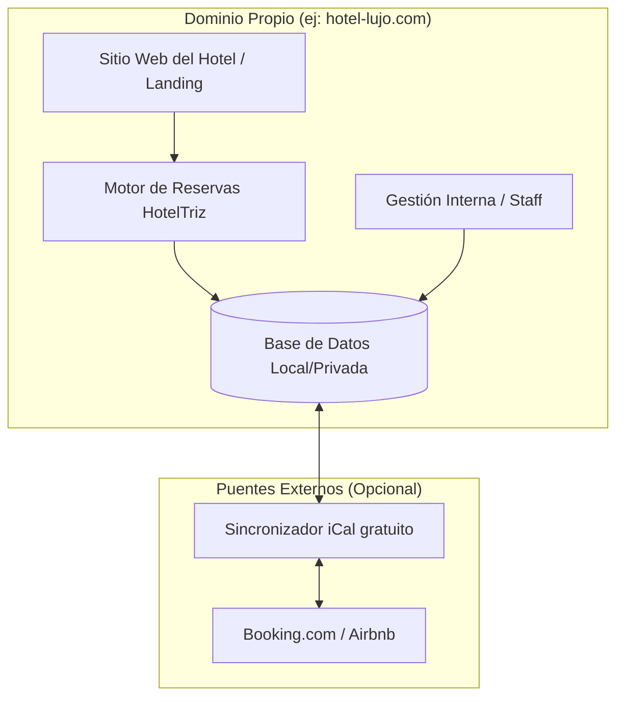

# 🏨 HotelTriz: Plan Maestro de Gestión Hotelera (Independencia Digital)

Este documento detalla la estrategia para **HotelTriz**, concebido como un **Motor de Reservas Directas** de alto rendimiento diseñado para dotar a los hoteles de independencia frente a las grandes plataformas (OTAs) como Booking o Airbnb. El software operará bajo dominio y base de datos propia para cada cliente.

---

## 🏗️ 1. Arquitectura de Independencia (Instancias Propias)

El sistema se desplegará como una instancia independiente por hotel, garantizando seguridad y soberanía de datos.

---

## 📦 2. Módulos Críticos del Sistema

| Módulo | Funcionalidad Principal |
| :--- | :--- |
| **🏠 Motor de Reservas (VISTA CLIENTE)** | Interfaz pública premium para búsqueda de fechas, selección de habitaciones y pago seguro. |
| **📊 Gestión de Reservas (VISTA STAFF)** | Calendario interactivo (Drag & Drop), Check-in manual y control de ocupación. |
| **📅 Sincronización iCal** | Conector gratuito de dos vías con Booking, Airbnb y Google Calendar. |
| **🛏️ Gestión de Inventario** | Control de tipos de habitación, estados de limpieza y mantenimiento. |
| **👤 Gestión de Huéspedes (CRM)** | Historial de clientes para fomentar la reserva directa recurrente. |
| **💳 Facturación y Pagos** | Integración con Stripe/PayPal para cobrar directo al cliente sin comisiones de OTA. |
| **👤 Portal del Huésped** | Área privada para gestionar estancias y servicios extra. |

---

## 🔌 3. Conectividad Segura y Gratuita (iCal Sync)

Para garantizar el costo cero de operación inicial:
1.  **Lector iCal Automático**: Script que consulta las URLs secretas de Booking/Airbnb cada 10 minutos.
2.  **Bloqueo Inteligente**: Si entra reserva en Airbnb, se bloquea en el hotel y viceversa.
3.  **Costo $0**: No requiere pagos mensuales a terceros (Channel Managers).

---

## 🛠️ 4. Stack Tecnológico

- **Frontend**: **React.js + Vite** (Interfaz fluida y responsive).
- **Backend**: **Node.js (Express)** (Ligero, eficiente y barato de hostear).
- **Base de Datos**: **PostgreSQL** (Robusta para transacciones financieras).
- **Seguridad**: Autenticación **JWT** y aislamiento total por instancia.

---

## 🗺️ 5. Roadmap de Desarrollo Especializado

1.  **Fase 1 (Cimientos)**: Estructura de DB (Habitaciones, Reservas) y Setup de Node.js.
2.  **Fase 2 (Venta)**: Desarrollo del **Motor de Reservas (Vista Cliente)** y Pagos.
3.  **Fase 3 (Control)**: Panel de Gestión (Staff) y Calendario Principal.
4.  **Fase 4 (Puente)**: Conector iCal automático para sincronizar Booking/Airbnb.
5.  **Fase 5 (Lanzamiento)**: Optimización SEO y despliegue en dominio independiente.

---

## 💰 6. Estrategia \"Costo Cero\"

- **Desarrollo**: Usaremos simuladores (Mocks) para no pagar APIs de prueba.
- **Hosting**: Optimizado para correr en servidores básicos de bajo costo.
- **Independencia**: El hotelero paga el software una vez o por suscripción fija, eliminando las comisiones del 15% de las OTAs.

---
