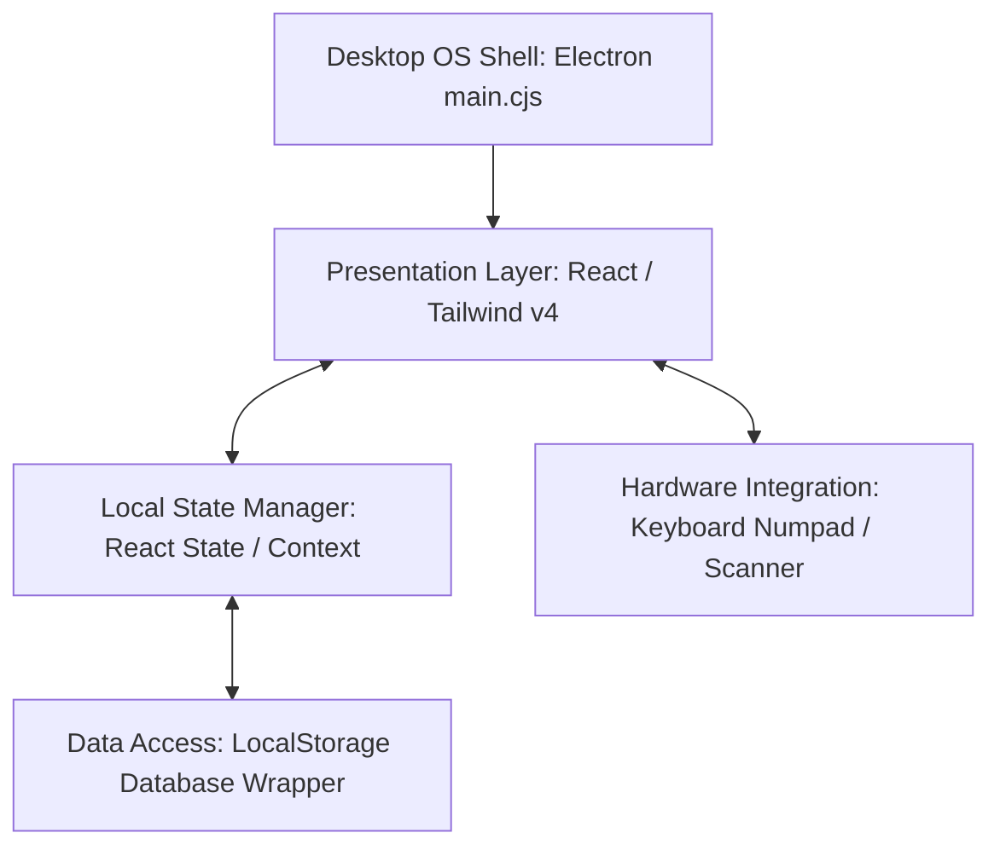

# Technical Manual: Offline Point of Sale (POS) System

This technical manual details the architecture, technologies, design patterns, and workflows implemented in the standalone POS application for the hotel shop.

---

## 1. System Architecture

The POS is structured as an **Offline-First Monolithic Desktop Application**, wrapping the React frontend interface within a native window shell using Electron.



### Architectural Highlights:
* **Decoupled Persistence**: Memory read/write operations are handled via a local storage abstraction layer mimicking a relational database database client.
* **Zero External Dependencies (Sandbox)**: The application requires no remote APIs to perform core functions. FontAwesome fonts and Tailwind styles are compiled and served locally.
* **Low Footprint**: Electron isolates the rendering process, resulting in highly optimized memory usage (approx. 40 MB RAM in idle).

---

## 2. Tech Stack

| Technology | Version | Purpose |
| :--- | :--- | :--- |
| **React** | `^19.2.4` | Component-based user interface library. |
| **Vite** | `^8.0.4` | Ultra-fast frontend bundler and dev server. |
| **Tailwind CSS** | `^4.2.2` | Modern, utility-first CSS styling engine. |
| **Electron** | `^33.2.1` | Native desktop window packaging environment. |
| **FontAwesome Local** | `^6.5.1` | Locally-served iconography for offline compliance. |
| **Concurrently** | `^8.2.2` | Parallel command runner to start Vite and Electron in dev mode. |

---

## 3. Implemented Design Patterns

The codebase adheres to the following software design patterns to ensure modularity, separation of concerns, and ease of future maintenance:

### A. Repository Pattern (Persistence Layer)
* **Location in Code**: `src/components/POSMain.jsx` (initialization routines and `saveProducts`, `saveSession`, `saveSalesHistory` helper functions).
* **Concept**: Instead of components writing directly to the browser storage, access is delegated to repository-like functions acting as data brokers.
* **Benefit**: If you need to sync sales with the hotel's cloud databases (e.g., Supabase or a central PostgreSQL API) or swap `localStorage` for a native SQLite file in the future, only these wrapper functions need to be updated. The UI remains completely untouched.

### B. State Pattern (Cash Register Shifts)
* **Location in Code**: Shift control state `session` and conditional view routing in `src/components/POSMain.jsx`.
* **Concept**: The app limits actions based on the current state of the cash drawer (`CLOSED` vs. `OPEN`). If the drawer is `CLOSED`, the UI blocks the sales catalog and checkout processes and forces the cashier to open a new shift.
* **Benefit**: Prevents cashier mistakes, such as registering sales before entering the drawer starting cash or issuing payouts after the shift has been finalized.

### C. Observer Pattern (Stock Threshold Warnings)
* **Location in Code**: The `lowStockItems` observable query inside `src/components/POSMain.jsx` bound to headers and alert dashboards.
* **Concept**: The products array acts as the observed subject. Whenever a checkout operation decrements stock, the alert modules observe the updated state and immediately repaint health indicator badges.
* **Benefit**: Cashiers receive real-time, warning alerts when inventory falls below minimum safety limits without manual database scans or page reloads.

### D. Strategy Pattern (Checkout Payment Strategies)
* **Location in Code**: Payment method `paymentMethod` selector (`CASH`, `CARD`, `ROOM_CHARGE`) and conditional checkout rendering in `src/components/POSMain.jsx`.
* **Concept**: The checkout action dynamically selects the validation and logging strategy according to the payment choice:
  * `CASH`: Calculates exact change based on money received.
  * `CARD`: Prompts and records credit terminal reference codes.
  * `ROOM_CHARGE`: Demands room and guest identification for hotel invoicing.
* **Benefit**: Adding new payment channels (like QR codes or digital wallets) is simple; just register a new strategy in the payment validator function.

---

## 4. Operational Runbook

### Step 1: Install Dependencies (First Run Only)
Requires Node.js installed on the computer. Run the following command inside the `pos` directory:
```bash
npm install
```
*This downloads the required libraries to `node_modules`.*

### Step 2: Run in Development Mode
* **Desktop Mode (Recommended)**:
  ```bash
  npm run electron:dev
  ```
  Starts Vite and Electron. The POS will launch in a clean, borderless native desktop window.
* **Browser Mode**:
  ```bash
  npm run dev
  ```
  Launch [http://localhost:3035](http://localhost:3035) in your local web browser.

### Step 3: Compile for Production (Strict Offline Distribution)
To deploy the app on a machine without network interfaces:
1. Run the build script:
   ```bash
   npm run build
   ```
2. Vite generates a compiled `dist/` directory containing all assets (HTML, CSS, JS, fonts).
3. Copy the `dist/` directory to the target machine. Launching `index.html` inside it will run the POS with 100% offline functionality.
